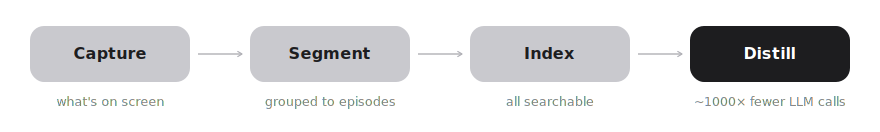

# Continuum

[](https://github.com/nikhilkagita04/continuum/actions/workflows/ci.yml)

**Your whole desktop context — everything you've seen, read, typed, and heard — as a single MCP your agent can use.**

You bounce between Claude, Slack, X, your editor, a call — a dozen apps a day — and each one starts
blank, so *you* become the courier: re-pasting, re-explaining, rebuilding context over and over.

Continuum carries it across. It quietly remembers what happens in every app — on your machine,
private, yours — and serves it to any agent over **MCP**. Ask Claude *"what was I just doing in X?"*
and it already knows.

Open source. Local-first. One command to connect.

<p align="center"><a href="https://youtu.be/WnltmAaom7E"></a></p>

<p align="center"><strong><a href="https://youtu.be/WnltmAaom7E">▶ Watch the demo</a></strong> — ask Claude <em>"what was I just doing in X?"</em> and it answers from your own captured activity.</p>

## Get started — hand it to your agent

Nobody wires up dev tools by hand anymore — you tell your agent to. Paste this into **Claude Code,
Codex, or Cursor** and it installs Continuum, starts capture, and connects the MCP for you:

> Set up Continuum so you can see my desktop context: install it (`npm i -g continuum-core`), start
> capture in the background (`continuum start &` — I'll grant Screen Recording when macOS prompts),
> then add the Continuum MCP server to your config using the JSON from `continuum mcp-config`. From
> then on, use the `search_context` and `recent_activity` tools on your own judgment — any time my
> request would be better with knowledge of what I've recently been doing, not just when I ask.

Then just ask it *"what was I doing in X?"* — that's the whole setup.

## Or run it yourself — about 30 seconds

Needs **Node 18+**. Don't have it? Grab it at [nodejs.org](https://nodejs.org) or `brew install node`.

```bash
npm install -g continuum-core
continuum verify          # prove it works — no keys, no permissions, no setup
```

`verify` captures a sample work session and answers questions about it — the whole
capture → memory → recall loop in one command.

<sub>Prefer source? <code>git clone https://github.com/nikhilkagita04/continuum && cd continuum && npm link</code></sub>

## Use it

```bash
continuum start
continuum dashboard
```

`start` captures what's on screen, on-device — grant **Screen Recording** once when macOS
prompts. `dashboard` opens your searchable timeline at `localhost:3939`.

## Connect it to your agent (MCP) — the payoff

Continuum speaks **MCP**, so any agent can query your desktop context. Pick the path that fits:

**Claude Desktop — one command:**

```bash
continuum mcp-install      # adds Continuum to Claude Desktop; your config is preserved + backed up
```

Then fully quit/reopen Claude (Cmd+Q) and ask *"what was I working on this morning?"*

**Any other client (Cursor, your own agent) — a 5-line block** (`continuum mcp-config` prints it):

```json
{ "mcpServers": { "continuum": { "command": "node", "args": [".../daemon/mcp-server.mjs"] } } }
```

(Or skip all this and use the **hand-it-to-your-agent** prompt up top — it does install + connect in one paste.)

Keep `continuum start` running so there's something to recall.

## What it is

A **primitive, not an app.** Most context tools are either closed "brain" apps you hand
everything to, or screen recorders that dump raw frames and leave you to dig. Continuum is the
open layer you build on:

- **Sees what you see — and hears what you hear** — on-device OCR of the whole focused window
  (captured only when it meaningfully changes, with repeated chrome de-duplicated so episodes are
  content not noise), plus optional on-device meeting transcription (mic + system audio,
  speaker-attributed, transcribe-then-delete) fused with what's on screen.
- **Local-first** — everything lives in `~/.continuum`; credential managers are excluded and
  PII is redacted; nothing leaves your machine.
- **Composable** — query it from the CLI, the SDK, or MCP, so any agent can use your memory.

## Tiers

| | Free | Pro *(later)* | Enterprise *(later)* |
|---|---|---|---|
| Capture · recall · MCP | ✅ | ✅ | ✅ |
| Embeddings / LLM | local, $0 | OpenAI / Anthropic | hosted |
| Temporal knowledge graph | — | ✅ | ✅ team graph |

The graph tier needs a frontier model (local models can't do reliable entity extraction), so
it's the natural paid line. Everything below it is free and local.

## How it works

<p align="center"></p>

Four stages turn ~29k raw daily events into ~30 LLM calls — and the LLM never touches the
capture path, which is what keeps it light. Deep dive:
[docs/architecture/ingestion-pipeline.md](docs/architecture/ingestion-pipeline.md).

## Build on it

The stages are importable modules — a useful tool is ~20 lines. See `examples/` for a standup
generator and the Claude Desktop MCP config.

## Develop

```bash
npm test
swiftc daemon/stage1/screen.swift -o daemon/stage1/screen
```

`npm test` runs the suite (no network); `continuum eval` reports capture-quality metrics (OCR
fidelity, segmentation, grounding, end-to-end recall) over local fixtures. The second line builds the
macOS screen-capture helper. Contributions under [DCO](https://developercertificate.org/)
(`git commit -s`). License: Apache-2.0.
